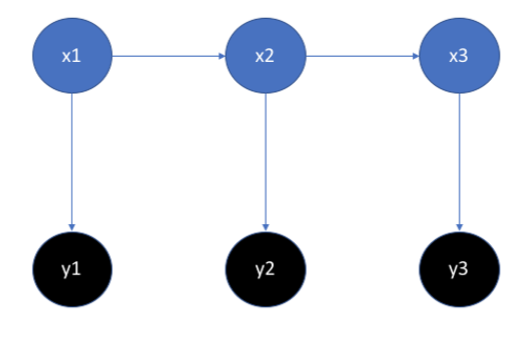

#   Praktikum 04 Markov und CRF
##   Aufgabe 1

MEMM = Maximum entropy Markov model
Kombination aus HMMs und Maximum entropy models
Nimmmt an, das EWerte miteinander verbunden sind und nicht unabhängig
Beobachtungen sind nicht nur vom Zustand, sondern auch von der vorherigen Beobachtung abhängig.
Effizienter als HMMs/CRFs

##   Aufgabe 3

### Baum-Welch und EM

Em-Algorithmus für HMM

Forward-Backward-Algorithmus
Berechnet zuerst Maximum-Likelihood
Dann Frequenz

### Expectation
Frequenz der Übergangs-Zustands-Paar Werte

### Maximization
Maximum-Likelihood neu berechnen anhand der Frequenz

## Aufgabe 2

### Zustanddiagramm

### Transitionsmatrix

| State 1 | State 2 | Transition-likelihood |
| ------- | ------- | --------------------- |
| S1	  | S1		| 0.8					|
| S1	  | S2      | 0.2					|
| S2	  | S1		| 0.07					|
| S2	  | S2		| 0.93					|

### Emissionsmatrix

| S1     | S2      | Emission |
| ------ | ------- | -------- |
| 0.1667 | 0.58334 | 1		  |
| 0.1667 | 0.08334 | 2		  |
| 0.1667 | 0.08334 | 3		  |
| 0.1667 | 0.08334 | 4		  |
| 0.1667 | 0.08334 | 5		  |
| 0.1667 | 0.08334 | 6		  |

### Emissionsgenerierung

[Emissionsgenerierung (python)](./a4b.py)

### Viterbi

[Viterbi (python)](./a4c.py)

## Aufgabe 4

### CRFs (Conditional Random Fields) vs. HMMs (Hidden Markov Models)

#### Unterschiede

HMMs sind ein generatives Modell, CRFs ein diskriminatives. CRFs können komplexere Abhängigkeiten zwischen Variablen modellieren als HMMs.

#### Ähnlichkeiten

#### CRFs (Conditional Random Fields)

CRFs modellieren nur die bedingten Wahrscheinlichkeiten. Jeder Zustand hängt nicht nur vom vorherigen Zustand ab. CRFs sind supervised.

#### HMMs (Hidden Markov Models)

Mit HMMs wird versucht, von Beobachtungen (Emissionen) eines Systems auf dessen Zustand zu schliessen. Der Zustand des Systems zu einem bestimmten Zeitpunkt ist dabei unbekannt (versteckt/hidden). Die Übergangswahrscheinlichkeiten von einem Zustand in den anderen hängen nur vom aktuellen Zustand ab und sind konstant. HMMs sind ein generatives Modell, d.h. sie können selber Beispiele erzeugen. Bei HMMs wird die vollständige Wahrscheinlichkeitsverteilung von Zustandsübergängen sowie Beobachtungen modelliert. Beobachtungswahrscheinlichkeiten sind nur vom aktuellen Zustand und nicht von anderen Beobachtungen abhängig.

##### Markov-Eigenschaften

1. Markow-Eigenschaft: Der aktuelle Wert des ersten Zustands hängt ausschlieÿlich von seinem letzten Wert ab 
2. Markow-Eigenschaft: Der aktuelle Wert des zweiten Zustands hängt ausschlieÿlich vom aktuellen Wert des ersten ab

### CRFs und logistische Regression

Logistische Regression kann als vereinfachtes CRF gesehen werden. Logistische Regression und CRFs sind beide diskriminative Modelle. 