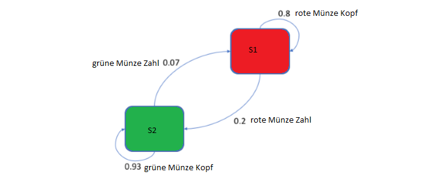

#   Praktikum 04 Markov und CRF
##   Aufgabe 1

MEMM = Maximum entropy Markov model
Kombination aus HMMs und Maximum entropy models
Nimmmt an, das EWerte miteinander verbunden sind und nicht unabhängig
Label probability geht in transition probability
Effizienter als HMMs/CRFs

##   Aufgabe 3

### Baum-Welch und EM
Forward-Backward-Algorithmus
Berechnet zuerst Maximum-Likelihood
Dann Frequenz

### Expectation
Frequenz der Übergangs-Zustands-Paar Werte

### Maximization
Maximum-Likelihood

## Aufgabe 2

### Zustanddiagramm

### Transitionsmatrix

| State 1 | State 2 | Transition-likelihood |
| ------- | ------- | --------------------- |
| S1	  | S1		| 0.8					|
| S1	  | S2      | 0.2					|
| S2	  | S1		| 0.07					|
| S2	  | S2		| 0.93					|

### Emissionsmatrix

| S1     | S2      | Emission |
| ------ | ------- | -------- |
| 0.1667 | 0.58334 | 1		  |
| 0.1667 | 0.08334 | 2		  |
| 0.1667 | 0.08334 | 3		  |
| 0.1667 | 0.08334 | 4		  |
| 0.1667 | 0.08334 | 5		  |
| 0.1667 | 0.08334 | 6		  |

### Emissionsgenerierung

[Script](./a4b.py)

